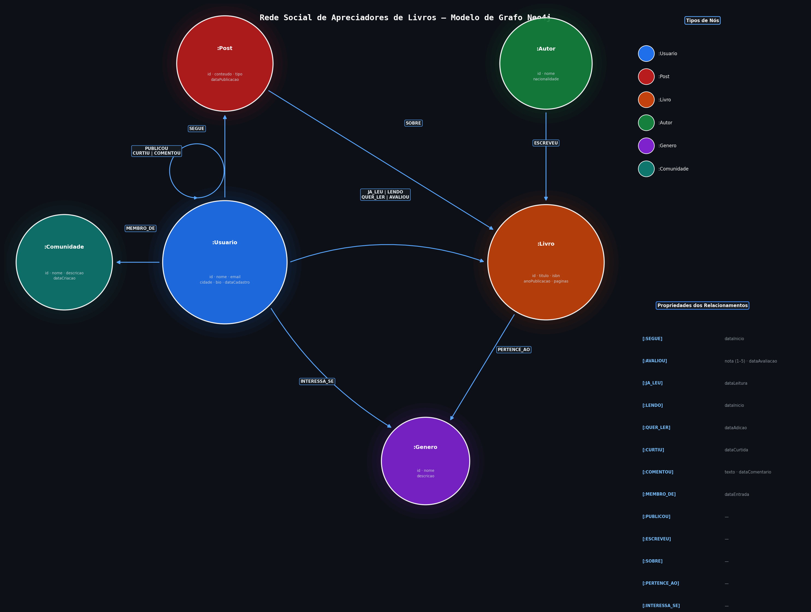

# Desafio 03 — Rede Social de Apreciadores de Livros

Modelagem de uma rede social para leitores usando **Neo4j** e **Cypher**, com foco em análise de engajamento, comunidades de interesse e recomendações baseadas em grafo.



---

## Objetivo

Criar um grafo capaz de responder perguntas complexas sobre comportamento de leitores:

- Quem são os leitores mais influentes da plataforma?
- Qual a menor distância entre dois usuários na rede?
- Que livros devo ler com base nos gostos de quem tem perfil parecido com o meu?
- Quem devo seguir para expandir minha rede literária?
- Qual post gerou mais engajamento no mês?
- Quais livros estão em alta na plataforma?
- Qual o público-alvo de cada gênero literário?

---

## Modelo de Dados

### Nós

| Label | Propriedades | Descrição |
|---|---|---|
| `Usuario` | `id`, `nome`, `email`, `cidade`, `bio`, `dataCadastro` | Perfil do leitor |
| `Livro` | `id`, `titulo`, `isbn`, `anoPublicacao`, `paginas` | Obra literária |
| `Autor` | `id`, `nome`, `nacionalidade` | Escritor do livro |
| `Genero` | `id`, `nome`, `descricao` | Categoria literária |
| `Post` | `id`, `conteudo`, `tipo`, `dataPublicacao` | Publicação do usuário (Resenha, Recomendação ou Discussão) |
| `Comunidade` | `id`, `nome`, `descricao`, `dataCriacao` | Grupo de leitores por interesse |

### Relacionamentos

| Relacionamento | De → Para | Propriedades |
|---|---|---|
| `SEGUE` | Usuario → Usuario | `dataInicio` |
| `JA_LEU` | Usuario → Livro | `dataLeitura` |
| `LENDO` | Usuario → Livro | `dataInicio` |
| `QUER_LER` | Usuario → Livro | `dataAdicao` |
| `AVALIOU` | Usuario → Livro | `nota` (1–5), `dataAvaliacao` |
| `PUBLICOU` | Usuario → Post | — |
| `CURTIU` | Usuario → Post | `dataCurtida` |
| `COMENTOU` | Usuario → Post | `texto`, `dataComentario` |
| `INTERESSA_SE` | Usuario → Genero | — |
| `MEMBRO_DE` | Usuario → Comunidade | `dataEntrada` |
| `ESCREVEU` | Autor → Livro | — |
| `PERTENCE_AO` | Livro → Genero | — |
| `SOBRE` | Post → Livro | — |

---

## Dataset

| Entidade | Quantidade |
|---|---|
| Usuários | 22 |
| Livros | 52 |
| Autores | 48 |
| Gêneros | 9 |
| Comunidades | 6 |
| Posts | 32 (15 resenhas · 8 recomendações · 9 discussões) |

### Gêneros contemplados
Ficção Científica · Fantasia · Romance · Mistério e Thriller · Terror · Literatura Brasileira · Desenvolvimento Pessoal · Biografia · Ficção Clássica

### Exemplos de livros por gênero

| Gênero | Títulos |
|---|---|
| Ficção Científica | Fundação, Duna, 1984, Admirável Mundo Novo, Neuromancer |
| Fantasia | O Senhor dos Anéis, Harry Potter, O Nome do Vento, Mistborn |
| Literatura Brasileira | Dom Casmurro, Grande Sertão: Veredas, A Hora da Estrela, O Alquimista |
| Mistério e Thriller | Garota Exemplar, Assassinato no Expresso do Oriente, O Código Da Vinci |
| Desenvolvimento Pessoal | O Poder do Hábito, Hábitos Atômicos, Mindset, Essencialismo |
| Biografia | Sapiens, Homo Deus, Steve Jobs, Eu Sou Malala |

---

## Arquivos

```
desafio03/
├── schema.cyp          # Constraints de unicidade e índices de busca
├── initial.cyp         # Inserção de todos os dados (UNWIND bulk inserts)
├── queries.cyp         # 15 consultas analíticas
├── visualizar_grafo.py # Gera o PNG do modelo de grafo
└── modelo_grafo.png    # Diagrama do modelo (gerado pelo script Python)
```

---

## Como Executar

### 1. Carregar o schema (constraints e índices)
```bash
cypher-shell -u neo4j -p secret2026 -f desafio03/schema.cyp
```

### 2. Inserir os dados
```bash
cypher-shell -u neo4j -p secret2026 -f desafio03/initial.cyp
```

> **Atenção:** o `initial.cyp` executa `MATCH (n) DETACH DELETE n` no início — limpa todo o banco antes de inserir.

### 3. Executar as consultas analíticas
```bash
cypher-shell -u neo4j -p secret2026 -f desafio03/queries.cyp
```

### 4. Regenerar o diagrama do modelo
```bash
uv run desafio03/visualizar_grafo.py
```

---

## Consultas Analíticas

### Engajamento e popularidade
| # | Pergunta | Técnica Cypher |
|---|---|---|
| 1 | Leitores mais influentes (ranking de seguidores) | `MATCH` + `count` + `ORDER BY` |
| 2 | Livros mais lidos na plataforma | `MATCH` + `count` + `ORDER BY` |
| 3 | Post mais curtido em um mês | `WHERE date range` + `WITH ... ORDER BY ... LIMIT` + `MATCH` |
| 13 | Livros em alta (score de engajamento agregado) | `OPTIONAL MATCH` múltiplo + score calculado |
| 15 | Top posts por engajamento (curtidas + comentários ponderados) | `OPTIONAL MATCH` + score ponderado |

### Recomendações
| # | Pergunta | Técnica Cypher |
|---|---|---|
| 4 | Recomendação de livros por filtragem colaborativa | Padrão `(eu)→(gênero)←(similar)→(livro)` |
| 5 | Sugestão de usuários para seguir | Amigos de amigos via `SEGUE*2` |
| 12 | Leitores com gostos mais similares | Interseção de `JA_LEU` + `INTERESSA_SE` |

### Análise de rede
| # | Pergunta | Técnica Cypher |
|---|---|---|
| 6 | Menor distância entre dois usuários | `shortestPath()` |
| 14 | Alcance viral de um livro pela rede | Travessia `SEGUE*1..2` com filtro de exclusão |

### Perfil e comunidades
| # | Pergunta | Técnica Cypher |
|---|---|---|
| 7 | Livros melhor avaliados por gênero | `avg()` + `WHERE count >= 2` |
| 8 | Autores mais lidos | `count(DISTINCT l)` + `count(u)` |
| 9 | Perfil completo do leitor | `OPTIONAL MATCH` múltiplo |
| 10 | Público-alvo por gênero (interesse vs. leitura efetiva) | Comparação entre `INTERESSA_SE` e `JA_LEU` |
| 11 | Comunidades mais ativas | `MEMBRO_DE` + `PUBLICOU` + `CURTIU` |

---

## Decisões de Modelagem

**Por que `JA_LEU`, `LENDO` e `QUER_LER` são relacionamentos separados?**
Representam estados distintos na jornada de leitura do usuário. Cada um carrega metadados próprios (data de início, data de conclusão) e permite consultas como "livros em alta" ou "taxa de conversão da lista de desejo".

**Por que `Post` é um nó e não uma propriedade?**
Posts se relacionam com múltiplas entidades: são publicados por um `Usuario`, tratam de um `Livro` e recebem `CURTIU` e `COMENTOU` de outros usuários. Modelar como nó permite calcular engajamento diretamente no grafo.

**Por que usar `INTERESSA_SE` além de inferir interesses pelos livros lidos?**
Captura intenção declarada, útil para recomendar livros de gêneros que o usuário ainda não explorou. Também permite segmentar o público-alvo sem depender do histórico de leitura.

**Por que `CURTIU` e `COMENTOU` são relacionamentos separados?**
Têm semânticas e propriedades distintas: `CURTIU` registra apenas a data, enquanto `COMENTOU` carrega o texto e permite análise de sentimento ou busca full-text no futuro.
